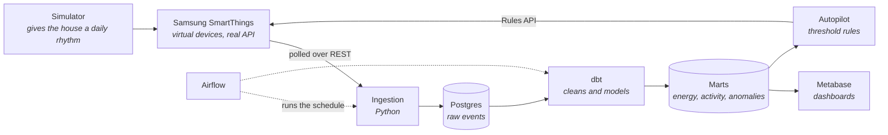

<p align="center">
  
</p>

<p align="center">
  <a href="https://github.com/R4SHM1T/gridline/actions/workflows/ci.yml"></a>
  
  
  
  
  
  <a href="https://r4shm1t.github.io/gridline/demo/"></a>
</p>

Gridline turns a smart home into a data warehouse, then lets the warehouse steer the home. It's built end to end on Samsung's SmartThings developer platform: virtual devices, the devices REST API, and the Rules engine.

## ▶ Try it first

**[Open the live demo](https://r4shm1t.github.io/gridline/demo/).** A virtual Samsung smart home running in your browser. Watch it wake up, cook dinner, go to sleep. Press "break something" and watch the house notice. Nothing to install.

## The problem

Every pipeline I'd built before this ran on static CSV files, and they taught me almost nothing. A file downloaded once never arrives late, never sends garbage, never rate-limits you at 2am. I wanted a data source that behaves like production, without buying a house full of hardware to get one. Samsung's SmartThings platform turned out to be the answer: it lets you create virtual devices that speak the same API as real ones, for free. So the telemetry is simulated, but everything it touches is real: real REST payloads, real token scopes, real rate limits, and a real rules engine to act on what the data says.

## How it works



Data flows out of the house into a warehouse. Decisions flow back into the house through the same Samsung API the data came from. Most pipelines stop at a dashboard; the point of this one is the round trip.

## What I learned building it

- How SmartThings tokens and scopes actually work, and what its rate limits do to a naive polling loop.
- Standing up Airflow locally and why idempotent tasks matter the first time a run dies halfway.
- dbt's testing discipline: sources, staging models, and letting `dbt build` catch what I break.
- That simulating realistic telemetry (morning rush, evening peak, appliances with signatures) is harder than ingesting it.

## Status

Building this in public, one tagged phase at a time. Roadmap lives in [PRD.md](PRD.md).

| Piece | State |
|---|---|
| Repo skeleton, CI, docker-compose | working |
| SmartThings polling into raw Postgres tables | working |
| Telemetry simulator with daily rhythms and injectable faults | working, unit-tested |
| Virtual fleet auto-provisioning | building now |
| dbt marts: energy, room activity, anomalies, device health | building now |
| Airflow production DAG with retries and backfills | building now |
| Metabase dashboards | next up |
| Autopilot: anomaly flags into SmartThings rules | next up |

What's simulated and what's real: no physical hardware anywhere. Devices are SmartThings virtual devices fed by the simulator, so anyone can reproduce the whole thing for free. If a number appears in this repo, a command reproduces it.

## Run it yourself

```bash
git clone https://github.com/R4SHM1T/gridline.git && cd gridline
cp .env.example .env    # token from https://account.smartthings.com/tokens
make demo               # postgres + metabase up, fleet seeded, pipeline run
make test               # simulator unit tests
```

You'll need a free Samsung developer account to mint the token: [developer.smartthings.com](https://developer.smartthings.com).

## What's next

- Swap local Postgres for a cloud warehouse and make the dbt models incremental.
- Move polling to event subscriptions once the fleet grows past what polite polling can cover.
