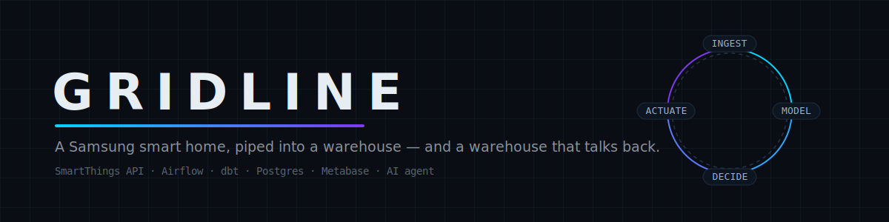
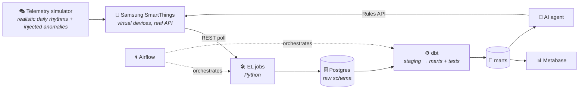

<p align="center">
  
</p>

<p align="center">
  <a href="https://github.com/R4SHM1T/gridline/actions/workflows/ci.yml"></a>
  
  
  
  
  
</p>

<p align="center">
  <b>Warehouse-grade analytics for a Samsung smart home.</b><br/>
  SmartThings telemetry → Airflow-orchestrated ingestion → dbt-modeled warehouse → dashboards →<br/>
  an AI agent that turns insights back into SmartThings automations.
</p>

---

## The closed loop

Most portfolio pipelines stop at a dashboard. This one closes the loop: data flows **out** of the home into a warehouse, and decisions flow **back** into the home through the SmartThings Rules API.



## See it

<!-- TODO(v0.6): replace placeholders with real captures.
     1. demo.gif       — terminal: `make demo` boot + Airflow DAG going green (record with ScreenToGif/Kap, keep < 10 MB)
     2. dashboard.png  — Metabase energy + room-activity boards
     3. agent.png      — agent transcript: question in, SmartThings rule out -->

| Pipeline run | Dashboards | Agent in action |
|---|---|---|
| _demo GIF coming in v0.6_ | _Metabase boards coming in v0.6_ | _agent transcript coming in v0.7_ |

## Why this exists

Every portfolio pipeline I'd seen — including my own early ones — ran on dead CSVs. Static datasets can't teach you what actually breaks pipelines in production: late-arriving events, flaky sensors, rate limits, schema drift. I wanted a source that *behaves* like production. Smart-home telemetry fit perfectly, but I wasn't going to buy a fleet of devices to learn on — and that's when I found that Samsung's SmartThings is the one major smart-home platform with a fully open developer surface: virtual devices that behave like real ones, real API payloads, real rate limits, a real rules engine. So the warehouse got built on Samsung's rails — and once telemetry was flowing, the obvious next step was closing the loop: let an agent act back on the home through the same API the data came from.

## Quickstart

```bash
git clone https://github.com/R4SHM1T/gridline.git && cd gridline
cp .env.example .env    # add your SmartThings personal access token
make demo               # boots postgres + metabase, seeds fleet, runs the pipeline
make test               # simulator unit tests
```

## Status — honest scope

This project is **v0.2 and under active development**; the roadmap lives in [PRD.md](PRD.md).

| Piece | State |
|---|---|
| Repo skeleton, CI, docker-compose | ✅ |
| SmartThings polling + raw landing | ✅ |
| Telemetry simulator (rhythms + anomalies, unit-tested) | ✅ |
| Virtual fleet auto-provisioning | 🚧 |
| dbt marts (energy, room activity, anomalies, device health) | 🚧 |
| Airflow production DAG (retries, backfills) | 🚧 |
| Metabase dashboards | 🖜 |
| Guard-railed AI agent → Rules API | 🖜 |

**What's simulated vs real:** no physical hardware — devices are SmartThings *virtual devices* driven by a realism-tuned simulator, so the pipeline consumes real Samsung API payloads and anyone can reproduce it for free. No invented metrics anywhere in this repo: if a number appears, a command reproduces it.

## What I'd do next

- Swap local Postgres for Snowflake/BigQuery; incremental dbt models.
- Batch → streaming (Kafka) for real-time anomaly detection.
